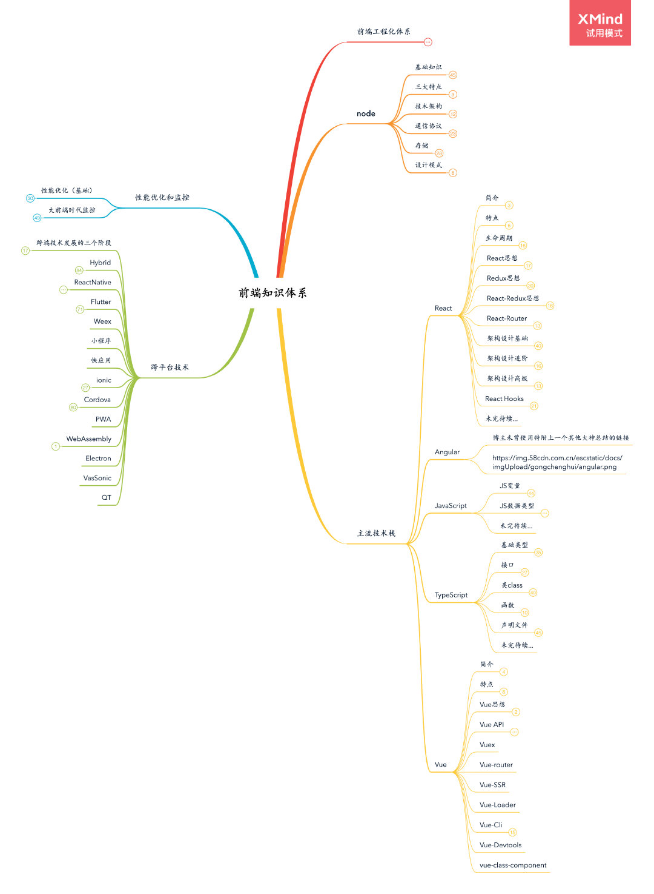
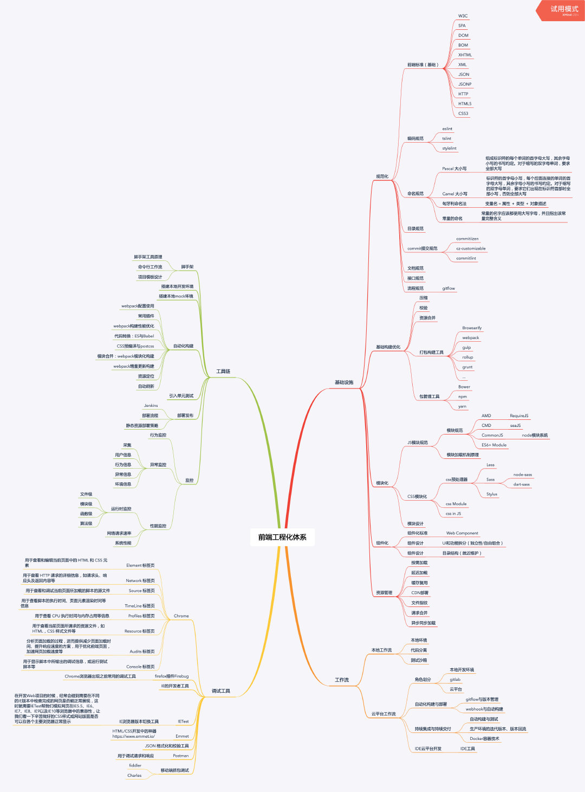
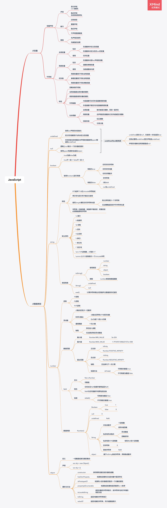
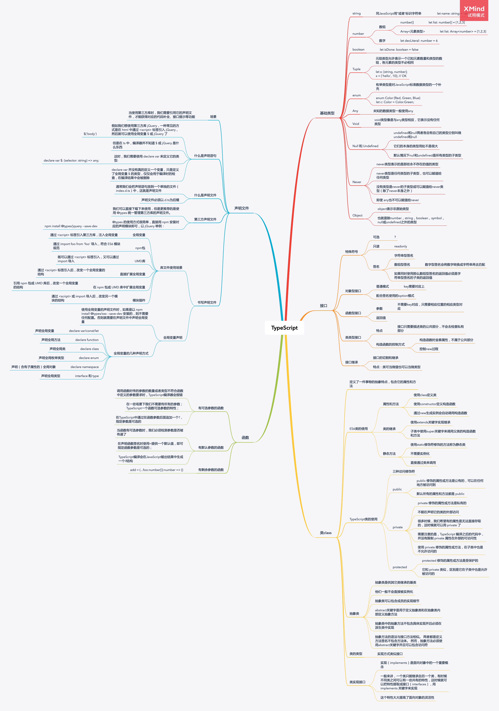
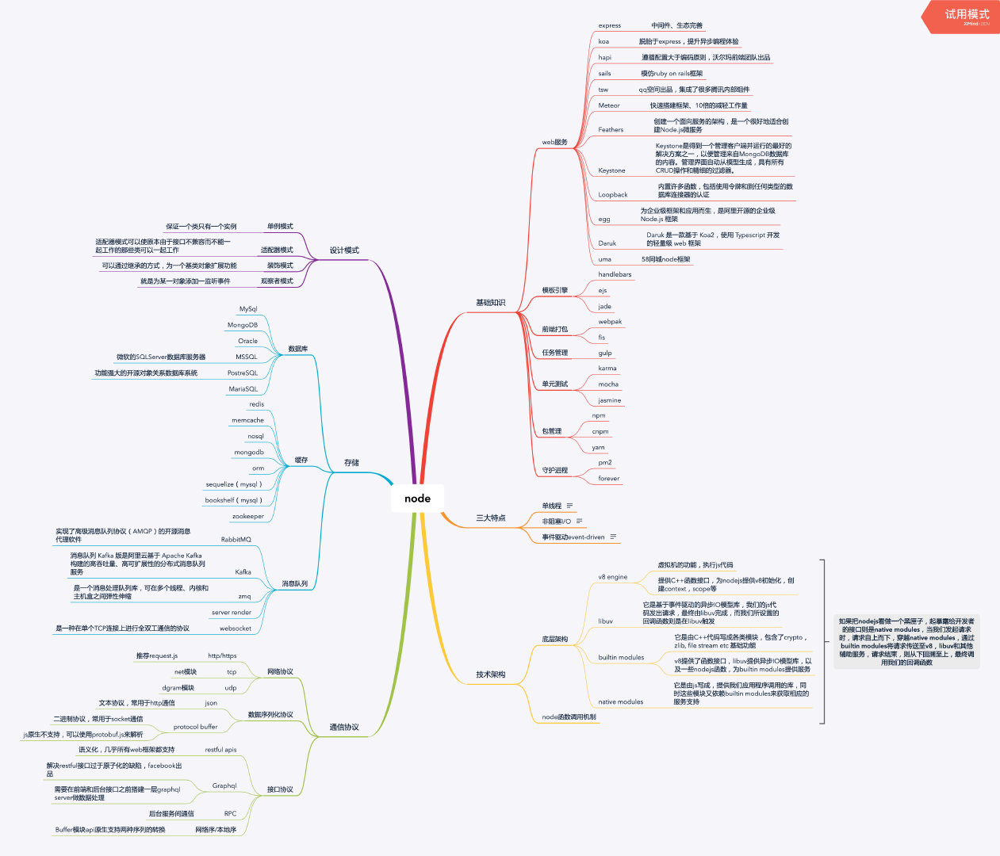
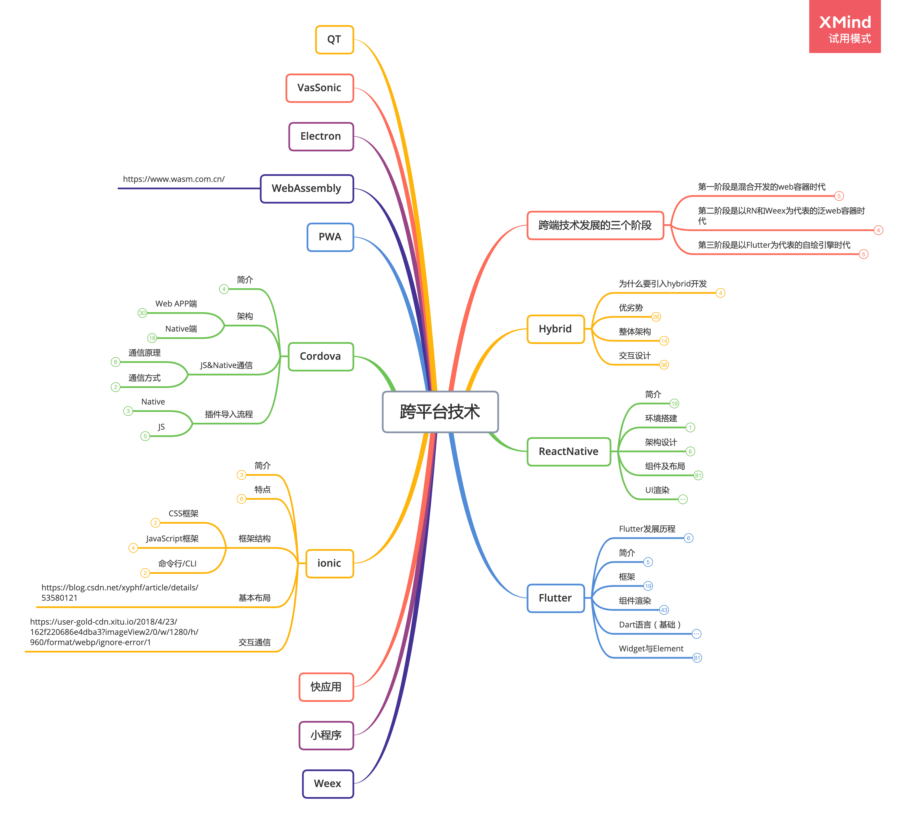
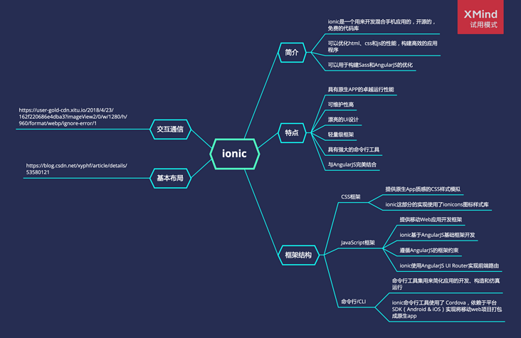
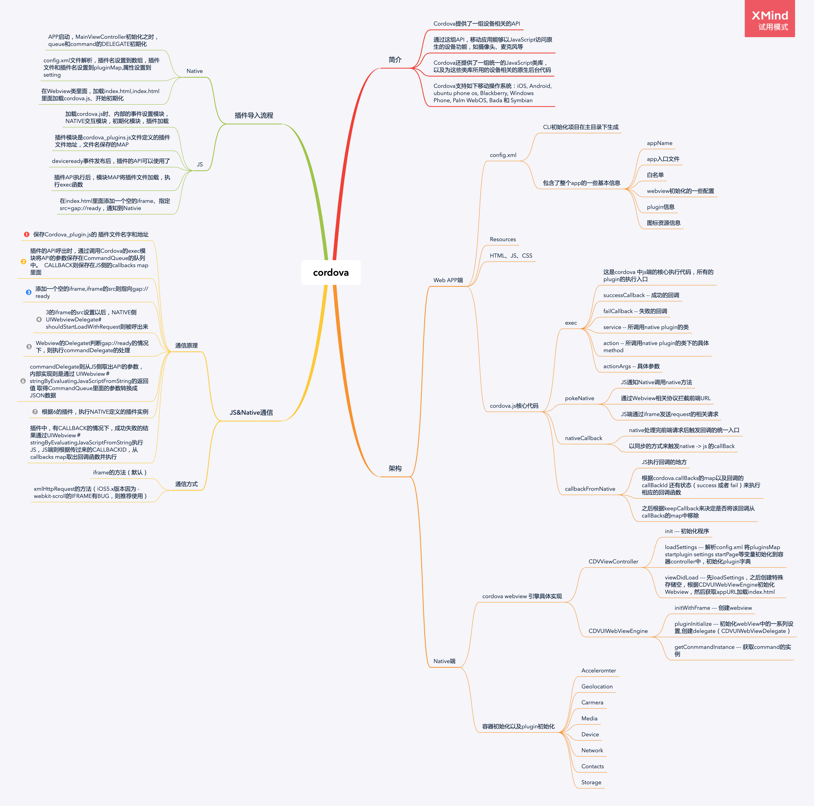

# Frontend Knowledge and Training

> A knowledge collection and guides for a frontend engineer

- [Frontend Knowledge and Training](#frontend-knowledge-and-training)
  - [Start Learning the Web Fundamentals](#start-learning-the-web-fundamentals)
  - [Knowledge Map](#knowledge-map)
    - [Overall view](#overall-view)
    - [Engineering Stacks](#engineering-stacks)
    - [JavaScript](#javascript)
    - [TypeScript](#typescript)
    - [NodeJs](#nodejs)
    - [React](#react)
    - [Vue](#vue)
    - [Angular](#angular)
    - [Hybrid](#hybrid)
      - [Ionic Framework / Cordova](#ionic-framework--cordova)
      - [ReactNative](#reactnative)
      - [flutter](#flutter)

Also see knowledge maps of: 
* [Server](./Server/readme.md)
  * Java / Spring
  * Nodejs / Nestjs, Eggjs, ...
* [DB](./DB/readme.md)
  * SQL

## Start Learning the Web Fundamentals

To learn the web fundamentals, we can goto the [W3Schools](https://www.w3schools.com) site which had very good courses on the web fundamental technologies (HTML/CSS/JS/NodeJS/Java/SQL, and many more...)

• [HTML](https://www.w3schools.com/html/default.asp) 
• [CSS](https://www.w3schools.com/css/default.asp) 
• [JavaScript](https://www.w3schools.com/js/default.asp) 
• [Sass](https://www.w3schools.com/sass/default.php) 
• [jQuery](https://www.w3schools.com/jquery/default.asp) 
• [NodeJs](https://www.w3schools.com/nodejs/default.asp) 
• [MySQL](https://www.w3schools.com/mysql/default.asp) 
• [React](https://www.w3schools.com/react/default.asp) 
• [Python](https://www.w3schools.com/python/default.asp) 
• ...

 

**To practise and test yourself:**

[Exercises](https://www.w3schools.com/exercises/index.php)

## Knowledge Map

### Overall view

### Engineering Stacks

### JavaScript

### TypeScript

### NodeJs

### React

### Vue

### Angular

### Hybrid

#### Ionic Framework / Cordova

#### ReactNative

#### flutter

